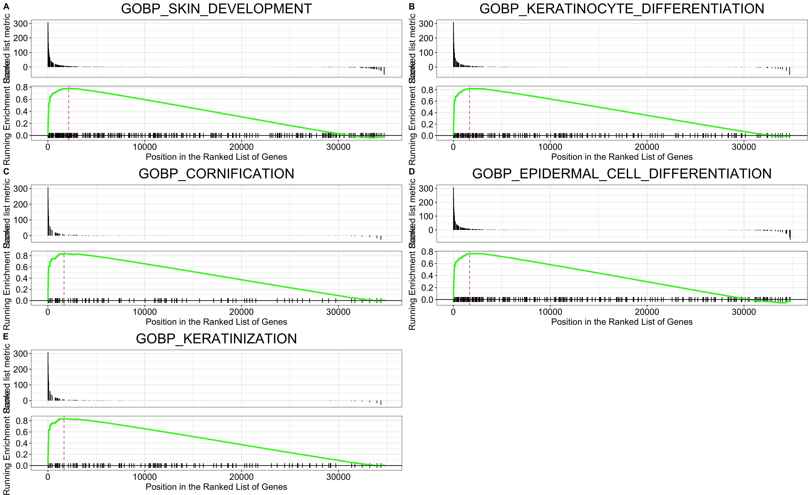
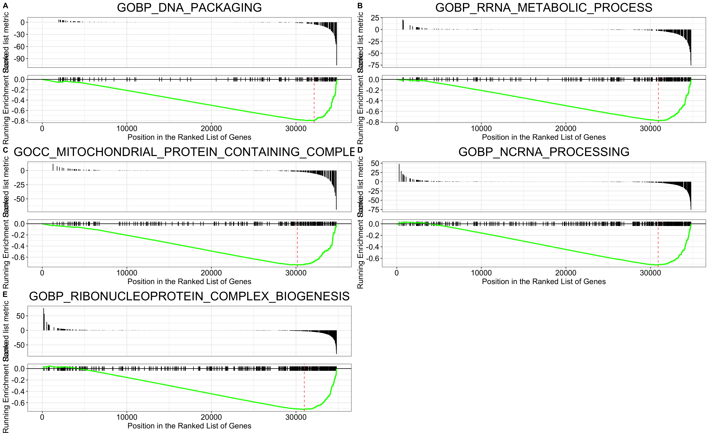

```{r setup, include=FALSE}
knitr::opts_chunk$set(echo = TRUE)

# Load libraries
library(knitr)
library(recount)
library(DESeq2)
library(tidyverse)
library(ggpubr)
library(EnhancedVolcano)
library(EnsDb.Hsapiens.v86)
library(msigdbr)
library(clusterProfiler)
library(ggplot2)
library(pheatmap)
```

# Introduction
## Acute Myeloid Leukemia

Acute Myeloid Leukemia is characterized by an increase in the number of myeloid cells in the marrow and the premature terminal of the maturation of these myeloid cells. This results primarily in hematopoietic insufficiency. DNA hypermethylation at gene promoters which leads to gene silencing is frequently observed.

Azacitidine is a DNA methyltransferase inhibitor (DNMTi) which has been used to treat AML patients. However, the inhibition is not permanent and DNA hypermethylation often resumes after treatment. Elucidating which genes are regulated by DNA methylation can inform further treatment strategies and provide a mechanistic understanding of the DNA demethylation in AML.

## Experimental Study Design 

In this study, OCI-AML3 cells were treated with 5-azacytidine, with a paired control. The experiment was done in triplicates and then total RNA was sequenced.

# Analysis Workflow
## Identification of Differentially Expressed Genes (DEGs)
The dataset was obtained from recount3 and DEGs were identified through the R package, DEseq2. The cutoffs used were log2 |fold change| >= 1 and *P*-value <0.05.


Following which, gene set enrichment analysis (GSEA) was performed with the clusterProfiler package in R. Top pathways were identified by the normalized enrichment score (NES).

```{r download-load, include= FALSE}
exp <- 'SRP038101'

url <- download_study(exp)

# Load data
load(file.path(exp, 'rse_gene.Rdata'))

# Add condition status, modify 'title' to indicate Replicates
rse_gene$cell = gsub('^[[:alpha:]]*\\.', 'Replicate ', rse_gene$title)
rse_gene$condition <- factor(ifelse(grepl("Untreated", colData(rse_gene)$title), "Untreated", "Treated"))

# change ensembl id to remove vers
rownames(rse_gene) <- gsub('\\.[0-9]*$', '', rownames(rse_gene))

```

# Data Quality Check
## Principal Component Analysis


In PCA, a clustering method is applied to essentially check if the treatment condition is the main variable responsible for variation in the data and to check if our replicates within each condition is similar. From the figure below, when separated by their treatment condition on PC1, the samples notably clusters by treatment condition and tightly within their treatment groups. We can see that the treatment condition accounts for 97% (PC1) of the variation and there is minimal variation between technical replicates (1%; PC2) which is ideal. 

```{r dds-PCA, echo = FALSE, results = 'last', message = FALSE, warning = FALSE, fig.align= 'center', fig.cap = "Fig.1: PCA of samples"}
# Create DEseq dataset: design formula variable of interest is treatment status
dds <- DESeqDataSet(rse_gene, ~condition)
dds$condition <- relevel(dds$condition, ref = "Untreated")

# Create PCA to inspect batch effect
# Perform regularized logarithm transformation (rlog) on the data; VST (>30 samples)
rld <- rlog(dds)

# Create PCA plot
pcaData <- plotPCA(rld, intgroup = "condition", returnData = TRUE)
percentVar <- round(100 * attr(pcaData, "percentVar"))

ggplot(pcaData, aes(PC1, PC2, color = condition)) +
  geom_point(size=3) +
  xlab(paste0("PC1: ",percentVar[1],"% variance")) +
  ylab(paste0("PC2: ",percentVar[2],"% variance")) + 
  coord_fixed() + labs(color='Treatment')
```

```{r deseq-lfcshrink-MAplot, include = FALSE}
# Analyse
dds <- DESeq(dds)

# Pre-filter low counts
keep <- rowSums(counts(dds)) >= 10
dds <- dds[keep,]

# Obtain results, contrast to indicate which is ref.
res <- results(dds, contrast = c("condition", "Treated", "Untreated"), alpha = 0.05)

# LFC shrink
normRes <- lfcShrink(dds, res = res, coef= "condition_Treated_vs_Untreated" , type= "apeglm")

# MA Plot
MAplot <- plotMA(normRes, ylim= c(-2,2))
```

# Differentially Expressed Genes (DEGs) Analysis

## Volcano Plot of DEGs

A volcano plot is typically used to quickly visualize the relationship between the p-value (or statisitcal significance) and log2 fold change in expression at the gene level. Using abritrary parameters ie. fold-change and p-value cut offs, we can visualize the proportion of genes that are signifcant genes and are up or down regulated.

In the figure below, we can see that following treatment with 5-azacytidine, there was not much significant DEGs and a large majority of the DEGs seem to be downregulated. There 495 DEGs identified with 24 upregulated and 471 downregulated genes.


```{r geneinfo-volplot, echo = FALSE, results = 'last', message = FALSE, warning = FALSE, fig.align= 'center', fig.cap = "Fig.2: Volcano Plot of Differentially Expressed Genes in Treated vs Untreated Samples"}
# Make a df out of the res
res_tb <- normRes %>%
  data.frame() %>%
  rownames_to_column(var="ensembl_id") %>% 
  as_tibble() 

# Creating a tibble of ENSEMBL (GENEID), ENTREZID, SYMBOL, GENENAME using EnsDb.Hsapiens.v86 db
anno <- as_tibble(AnnotationDbi::select(EnsDb.Hsapiens.v86,res_tb$ensembl_id, 
                                        columns=c("GENEID", "ENTREZID", "SYMBOL"), 
                                        keytype="GENEID"))

# left_join the res and the gene information
finRes <- res_tb %>%
  left_join(anno, by = c("ensembl_id" ="GENEID"))

# Plot Volcano
EnhancedVolcano( finRes, lab = finRes$SYMBOL, 
                 x = 'log2FoldChange', y = 'padj',
                 xlim = c(-8, 8), title = 'Treated vs Untreated',
                 pCutoff = 0.05, FCcutoff = 1.5, 
                 pointSize = 2.0, 
                 labSize = 3.0,
                 border = "full", borderWidth = 1.5, borderColour = "black", 
                 gridlines.major = FALSE, gridlines.minor = FALSE)

```

## Heatmap of all DEGs

Through a heatmap we can visualize the differences in gene expression between samples of different treatment conditions and observe for conistency within the treatment group. In the figure below, a significant number of genes are downregulated upon the 5-azacytidine treatment when compared to the control.

```{r DEG, echo = FALSE, results = 'last', message = FALSE, warning = FALSE, fig.align= 'center', fig.cap = "Fig.3: Heatmap of differentially expressed genes"}
sigRes <- finRes[which(finRes$padj < 0.05 & abs(finRes$log2FoldChange) > 1.5 & finRes$baseMean >= 20), ]

# Plot heatmap of all DE genes
mat <- assay(rld)   # Use the rlog normalized counts
idx <- sigRes$ensembl_id 
DEgenes <- mat[idx,]

annotation <- as.data.frame(colData(rld)[, c("cell", "condition")])

pheatmap(DEgenes, scale = "row", show_rownames = FALSE, clustering_distance_rows = "correlation", annotation_col = annotation, main="Differentially Expressed Genes")

```

## Top 20 Over- and Under-expressed DEGs

We then looked at the top 20 over and under expressed genes, visuazlied through a heatmap. 

The under expressed genes broadly contribute to tumour progression such as members of the **MAGE** protein family and **MMP13*. 

Notable genes that were over expressed include **CRLF2** which is involved in the development of the haemopoietic system. **RTN4RL1** is involved in cell signalling in the nervous system. **CPLX1** is involved in the final stages of exocytosis including synaptic vesicles. 

```{r Top20, echo = FALSE, results = 'last', message = FALSE, warning = FALSE, fig.align= 'center', fig.cap = c("Fig.4: Top 20 Over Expressed Genes", "Fig.5: Top 20 Under Expressed Genes")}
# Extract Top 20 Over and Under-expressed Genes
# Up
top20_up <- sigRes %>%
  dplyr::filter(log2FoldChange > 1.5 & padj < 0.05) %>%
  arrange(desc(log2FoldChange)) %>%
  head(20)

# Down
top20_down <- sigRes %>%
  dplyr::filter(log2FoldChange < 1.5 & padj < 0.05) %>%
  arrange(log2FoldChange) %>%
  head(20)

# Plot Heatmaps
# Up HM
top20_up_hm <- mat[top20_up$ensembl_id,]
rownames(top20_up_hm) <- top20_up$SYMBOL

pheatmap(top20_up_hm, scale = "row", clustering_distance_rows = "correlation", annotation_col = annotation)

# Under HM
top20_down_hm <- mat[top20_down$ensembl_id,]
rownames(top20_down_hm) <- top20_down$SYMBOL

pheatmap(top20_down_hm, scale = "row", clustering_distance_rows = "correlation", annotation_col = annotation)

```

# Pathway Analysis
## GSEA

Since small changes in a single gene expression can have cascading effects, it would be relevant to look at changes in entire pathways to provide a more holistic view. This is done through GSEA analysis.
```{r GSEA, include = FALSE}
# Create gene set for ref
gene_sets <- msigdbr(species = "Homo sapiens", category = "C5")
gene_sets <- gene_sets %>%
  dplyr::select(gs_name, gene_symbol)

# Adding a score for GSEA
gsea_df <- finRes%>%
  arrange(padj) %>%
  mutate(gsea_metric = -log10(padj) * sign(log2FoldChange))

# Deal with inf (swap up the inf with the highest pvalue)
gsea_df <- gsea_df %>%
  mutate(padj = case_when(padj == 0 ~ .Machine$double.xmin,
                          TRUE ~ padj)) %>%
  mutate(gsea_metric = -log10(padj) * sign(log2FoldChange)) 

# Remove NAs and order by GSEA
gsea_df <- gsea_df  %>%
  dplyr::filter(! is.na(gsea_metric)) %>%
  arrange(desc(gsea_metric)) # needed to run GSEA later

# GSEA value histogram
# hist(gsea_df$gsea_metric, breaks = 100)

# Get the ranked GSEA vector
ranks <- gsea_df %>%
  dplyr::select(SYMBOL, gsea_metric) %>%
  distinct(SYMBOL, .keep_all = TRUE) %>%
  deframe()

# Run GSEA
gseares <- GSEA(geneList = ranks, 
                TERM2GENE = gene_sets,
                pvalueCutoff = 1)

gsearesdf <- as.data.frame(gseares)

# Plot GSEA results
# Top 5 Over
# Make GSEA plot for top and bottom results
top_pathways <- gsearesdf %>%
  top_n(n = 5, wt = NES) %>%
  pull(ID)

#  Make gseaplot for each and return as list
top_pathway_plots <- lapply(top_pathways, function(pathway) {
  gseaplot(gseares, geneSetID = pathway, title = pathway)
})

# Arrange with labels as a multi-panel plot
top_pathway_plot <- ggarrange(plotlist = top_pathway_plots,
                              ncol = 2, nrow = 3, labels = "AUTO")


#  Save it
ggsave(top_pathway_plot, filename = "top_GSEA_up.png",
       height = 11, width = 18)

# Top 5 Under
bottom_pathways <- gsearesdf %>%
  top_n(n = 5, wt = -NES) %>%
  pull(ID)

bottom_pathway_plots <- lapply(bottom_pathways, function(pathway) {
  gseaplot(gseares, geneSetID = pathway, title = pathway)
})

bottom_pathway_plot <- ggarrange(plotlist = bottom_pathway_plots,
                                 ncol = 2, nrow = 3, labels = "AUTO")

ggsave(bottom_pathway_plot, filename = "top_GSEA_down.png",
       height = 11, width = 18)
```


```{r gsea-figs, fig.align= "center", fig.cap = c("Fig.6: Top 5 Over Expressed Pathways", "Fig.7: Top 5 Under Expressed Pathways")}



```


# Discussion
Unexpectedly, the individual significant genes identified through the heatmap were not significantly

The top over expressed pathways broadly belong to cell cycle and cell replication processes. Meanwhile, the top underexpressed pathways were notably linked to the immune response such as response to interferon gamma and response to viral infections, and phagocytotic processes. 

Moving forward, the RNA-seq analysis should be complemented by differential DNA methylation analysis to establish a correlation 


