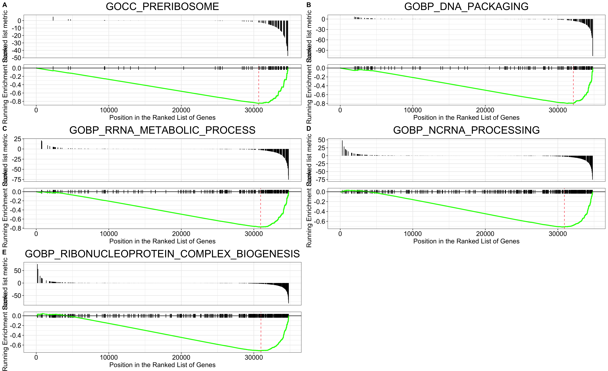

```{r setup, include=FALSE}
knitr::opts_chunk$set(echo = TRUE)

# Load libraries
library(knitr)
library(recount)
library(DESeq2)
library(tidyverse)
library(ggpubr)
library(EnhancedVolcano)
library(EnsDb.Hsapiens.v86)
library(msigdbr)
library(clusterProfiler)
library(ggplot2)
library(pheatmap)
```

# Introduction
## Acute Myeloid Leukemia

Acute Myeloid Leukemia is characterized by an increase in the number of myeloid cells in the marrow and the premature terminal of the maturation of these myeloid cells. This results primarily in hematopoietic insufficiency.

## Azacitidine

Azacitidine is a DNA methyltransferase inhibitor (DNMTi) which has been used to treat AML patients. However, it is unclear what the relationship between hypomethylation and gene expression is. Elucidating which genes are regulated as a result of hypomethylation could be key in other future therapeutic strategies.

## Study Design

In this study, OCI-AML3 cells were treated with 5-azacytidine, with a paired control. The experiment was done in triplicates and then total RNA was sequenced.  

```{r download-load, include= FALSE}
exp <- 'SRP038101'

url <- download_study(exp)

# Load data
load(file.path(exp, 'rse_gene.Rdata'))

# Add condition status, modify 'title' to indicate Replicates
rse_gene$cell = gsub('^[[:alpha:]]*\\.', 'Replicate ', rse_gene$title)
rse_gene$condition <- factor(ifelse(grepl("Untreated", colData(rse_gene)$title), "Untreated", "Treated"))

# change ensembl id to remove vers
rownames(rse_gene) <- gsub('\\.[0-9]*$', '', rownames(rse_gene))

```

# Data Quality Check
## Principal Component Analysis

In PCA, a clustering method is applied to essentially check if the treatment condition is the main variable responsible for variation in the data and to check if our replicates within each condition is similar. From the figure below we can see that the treatment condition accounts for 97% (PC1) of the variation and there is minimal variation between technical replicates (1%; PC2). 

```{r dds-PCA, echo = FALSE, results = 'last', message = FALSE, warning = FALSE, fig.align= 'center', fig.cap = "Fig.1: PCA of samples"}
# Create DEseq dataset: design formula variable of interest is treatment status
dds <- DESeqDataSet(rse_gene, ~condition)
dds$condition <- relevel(dds$condition, ref = "Untreated")

# Create PCA to inspect batch effect
# Perform regularized logarithm transformation (rlog) on the data; VST (>30 samples)
rld <- rlog(dds)

# Create PCA plot
pcaData <- plotPCA(rld, intgroup = "condition", returnData = TRUE)
percentVar <- round(100 * attr(pcaData, "percentVar"))

PCAplot <- ggplot(pcaData, aes(PC1, PC2, color = condition)) +
  geom_point(size=3) +
  xlab(paste0("PC1: ",percentVar[1],"% variance")) +
  ylab(paste0("PC2: ",percentVar[2],"% variance")) + 
  coord_fixed() + labs(color='Treatment')
```

```{r deseq-lfcshrink-MAplot, include = FALSE}
# Analyse
dds <- DESeq(dds)

# Pre-filter low counts
keep <- rowSums(counts(dds)) >= 10
dds <- dds[keep,]

# Obtain results, contrast to indicate which is ref.
res <- results(dds, contrast = c("condition", "Treated", "Untreated"))

# LFC shrink
normRes <- lfcShrink(dds, res = res, coef= "condition_Treated_vs_Untreated" , type= "apeglm")

# MA Plot
MAplot <- plotMA(normRes, ylim= c(-2,2))
```

# Differentially Expressed Genes (DEGs) Analysis

## Volcano Plot of DEGs

A volcano plot is typically used to quickly visualize the relationship between the p-value (or statisitcal significance) and log2 fold change in expression at the gene level. Using abritrary parameters ie. fold-change and p-value cut offs, we can visualize the proportion of genes that are signifcant genes and are up or down regulated.

In the figure below, we can see that following treatment with 5-azacytidine, there was not much significantly DEGs and a large majority of the DEGs seem to be downregulated. The parameters used were: **adjusted p-value <= 0.05 and absolute fold-change >=1.5**.


```{r geneinfo-volplot, echo = FALSE, results = 'last', message = FALSE, warning = FALSE, fig.align= 'center', fig.cap = "Fig.2: Volcano Plot of Differentially Expressed Genes in Treated vs Untreated Samples"}
# Make a df out of the res
res_tb <- normRes %>%
  data.frame() %>%
  rownames_to_column(var="ensembl_id") %>% 
  as_tibble() 

# Creating a tibble of ENSEMBL (GENEID), ENTREZID, SYMBOL, GENENAME using EnsDb.Hsapiens.v86 db
anno <- as_tibble(AnnotationDbi::select(EnsDb.Hsapiens.v86,res_tb$ensembl_id, 
                                        columns=c("GENEID", "ENTREZID", "SYMBOL"), 
                                        keytype="GENEID"))

# left_join the res and the gene information
finRes <- res_tb %>%
  left_join(anno, by = c("ensembl_id" ="GENEID"))

# Plot Volcano
EnhancedVolcano( finRes, lab = finRes$SYMBOL, 
                 x = 'log2FoldChange', y = 'padj',
                 xlim = c(-8, 8), title = 'Treated vs Untreated',
                 pCutoff = 0.05, FCcutoff = 1.5, 
                 pointSize = 2.0, 
                 labSize = 3.0,
                 border = "full", borderWidth = 1.5, borderColour = "black", 
                 gridlines.major = FALSE, gridlines.minor = FALSE)

```

## Heatmap of all DEGs

Through a heatmap we can visualize the differences in gene expression between samples of different treatment conditions and observe for conistency within the treatment group. In the figure below, a significant number of genes are downregulated upon the 5-azacytidine treatment when compared to the control.

```{r DEG, echo = FALSE, results = 'last', message = FALSE, warning = FALSE, fig.align= 'center', fig.cap = "Fig.3: Heatmap of differentially expressed genes"}
sigRes <- finRes[which(finRes$padj < 0.1 & abs(finRes$log2FoldChange) >= 1.5 & finRes$baseMean >= 20), ]

# Plot heatmap of all DE genes
mat <- assay(rld)   # Use the rlog normalized counts
idx <- sigRes$ensembl_id 
DEgenes <- mat[idx,]

annotation <- as.data.frame(colData(rld)[, c("cell", "condition")])

pheatmap(DEgenes, scale = "row", show_rownames = FALSE, clustering_distance_rows = "correlation", annotation_col = annotation, main="Differentially Expressed Genes")

```

## Top 20 Over- and Under-expressed DEGs

We then looked at the top 20 over and under expressed DEGs, visuazlied through a heatmap. 
```{r Top20, echo = FALSE, results = 'last', message = FALSE, warning = FALSE, fig.align= 'center', fig.cap = c("Fig.4: Top 20 Over Expressed Genes", "Fig.5: Top 20 Under Expressed Genes")}
# Extract Top 20 Over and Under-expressed Genes
# Up
top20_up <- sigRes %>%
  dplyr::filter(log2FoldChange > 1.5 & padj < 0.05) %>%
  arrange(desc(log2FoldChange)) %>%
  head(20)

# Down
top20_down <- sigRes %>%
  dplyr::filter(log2FoldChange < 1.5 & padj < 0.05) %>%
  arrange(log2FoldChange) %>%
  head(20)

# Plot Heatmaps
# Up HM
top20_up_hm <- mat[top20_up$ensembl_id,]
rownames(top20_up_hm) <- top20_up$SYMBOL

pheatmap(top20_up_hm, scale = "row", clustering_distance_rows = "correlation", annotation_col = annotation)

# Under HM
top20_down_hm <- mat[top20_down$ensembl_id,]
rownames(top20_down_hm) <- top20_down$SYMBOL

pheatmap(top20_down_hm, scale = "row", clustering_distance_rows = "correlation", annotation_col = annotation)

```

# Pathway Analysis
## GSEA

GSEA is used to have a more holistic view, looking at changes at entire pathways instead of a single gene. 
```{r GSEA, include = FALSE}
# Create gene set for ref
gene_sets <- msigdbr(species = "Homo sapiens", category = "C5")
gene_sets <- gene_sets %>%
  dplyr::select(gs_name, gene_symbol)

# Adding a score for GSEA
gsea_df <- finRes%>%
  arrange(padj) %>%
  mutate(gsea_metric = -log10(padj) * sign(log2FoldChange))

# Deal with inf (swap up the inf with the highest pvalue)
gsea_df <- gsea_df %>%
  mutate(padj = case_when(padj == 0 ~ .Machine$double.xmin,
                          TRUE ~ padj)) %>%
  mutate(gsea_metric = -log10(padj) * sign(log2FoldChange)) 

# Remove NAs and order by GSEA
gsea_df <- gsea_df  %>%
  dplyr::filter(! is.na(gsea_metric)) %>%
  arrange(desc(gsea_metric)) # needed to run GSEA later

# GSEA value histogram
# hist(gsea_df$gsea_metric, breaks = 100)

# Get the ranked GSEA vector
ranks <- gsea_df %>%
  dplyr::select(SYMBOL, gsea_metric) %>%
  distinct(SYMBOL, .keep_all = TRUE) %>%
  deframe()

# Run GSEA
gseares <- GSEA(geneList = ranks, 
                TERM2GENE = gene_sets,
                pvalueCutoff = 1)

gsearesdf <- as.data.frame(gseares)

# Plot GSEA results
# Top 5 Over
# Make GSEA plot for top and bottom results
top_pathways <- gsearesdf %>%
  top_n(n = 5, wt = NES) %>%
  pull(ID)

#  Make gseaplot for each and return as list
top_pathway_plots <- lapply(top_pathways, function(pathway) {
  gseaplot(gseares, geneSetID = pathway, title = pathway)
})

# Arrange with labels as a multi-panel plot
top_pathway_plot <- ggarrange(plotlist = top_pathway_plots,
                              ncol = 2, nrow = 3, labels = "AUTO")


#  Save it
ggsave(top_pathway_plot, filename = "top_GSEA_up.png",
       height = 11, width = 18)

# Top 5 Under
bottom_pathways <- gsearesdf %>%
  top_n(n = 5, wt = -NES) %>%
  pull(ID)

bottom_pathway_plots <- lapply(bottom_pathways, function(pathway) {
  gseaplot(gseares, geneSetID = pathway, title = pathway)
})

bottom_pathway_plot <- ggarrange(plotlist = bottom_pathway_plots,
                                 ncol = 2, nrow = 3, labels = "AUTO")

ggsave(bottom_pathway_plot, filename = "top_GSEA_down.png",
       height = 11, width = 18)
```
The top 5 pathways overexpressed 
```{r gsea-figs, fig.align= "center", fig.cap = c("Fig.6: Top 5 Over Expressed Pathways", "Fig.7: Top 5 Under Expressed Pathways")}



```
